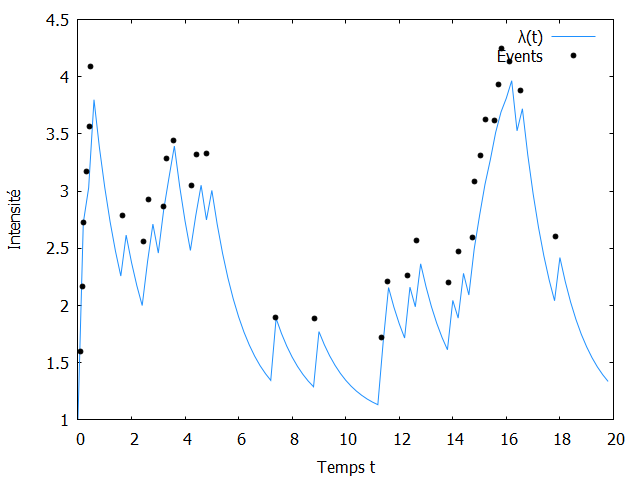

# Rust implementation of Point processes

Point processes are used in seismology, social network analysis, and prediction of financial events.



This repository implements an algorithm to simulate point processes inside the [Rust programming language](https://rust-lang.org).

To run the examples, do for instance

```bash
cargo run --example variable_poisson
```

For now, only one-dimensional point processes have been implemented.

## Poisson point process

A Poisson process on the real line is a stochastic process that can be used to model the arrival of random events.

## Hawkes point process
