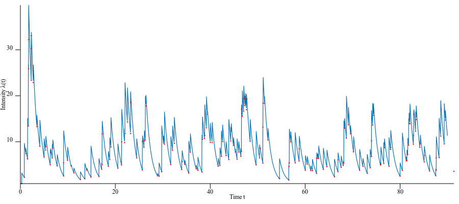
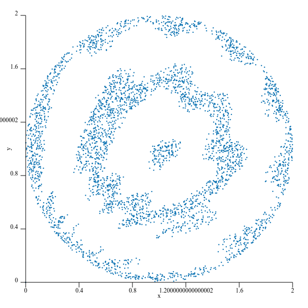

# Point processes in Rust

[](https://crates.io/crates/point_process)
[](https://docs.rs/point_process)
[](https://raw.githubusercontent.com/ManifoldFR/point-process-rust/master/LICENSE)

Point processes are stochastic processes with a wide range of applications in seismology, epidemiology, or financial mathematics. They are utilized to model the arrival of random events as a function of time.


This crate provides functions to simulate point processes in [Rust](https://rust-lang.org), built on top of [`ndarray`](https://github.com/bluss/ndarray).

## Time-dependent processes

The following time-dependent point processes have been implemented within the `timedependent` module:

* Poisson point process (homogeneous and inhomogeneous, with custom function)
* Hawkes processes, with an exponential kernel (refer to Dassios and Zhao's 2013 paper [(1)]) 

## n-dimensional processes



The `generalized` module provides functions for higher-dimensional processes.

For now, only Poisson processes have been implemented.

```rust
fn poisson_process(lambda: f64, domain: &T)
where T: Set -> ndarray::Array<f64, Ix2> {
    ...
}

fn variable_poisson<F, T>(lambda: F,max_lambda: f64,domain: &T) -> Array2<f64>
where F: Fn(&Array1<f64>) -> f64,
      T: Set
{
    ...
}
```

which takes a reference to a _domain_, that is a subset of n-dimensional space implemented with the `Set` trait (see API docs), and returns a 2-dimensional array which is a set of point events in d-dimensional space falling into the domain.

## Examples

Some examples require a yet unpublished version of milliams' [plotlib](https://github.com/milliams/plotlib) graphing library. To build them, you'll need to checkout plotlib locally:

```bash
git clone https://github.com/milliams/plotlib
cargo build --example 2d_poisson
```

To run the examples, do for instance

```bash
cargo run --example variable_poisson
```

Some will produce SVG image files in the `examples` directory.

The examples show how to use the API.

[(1)]: http://eprints.lse.ac.uk/51370/1/Dassios_exact_simulation_hawkes.pdf "Exact simulation of Hawkes process with exponentially decaying intensity"