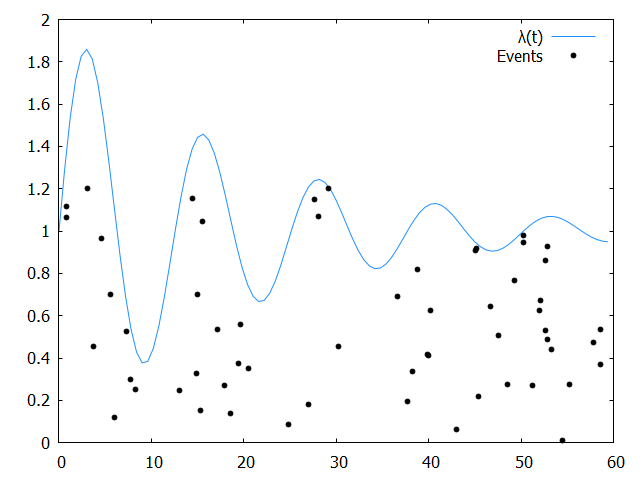

# Point processes in Rust

[](https://crates.io/crates/point_process)
[](https://raw.githubusercontent.com/ManifoldFR/point-process-rust/master/LICENSE)

Point processes are useful statistical models used in fields such as seismology, telecommunications, epidemiology, financial mathematics. They help to model such things as the arrival of random events in time.



This crate provides functions to simulate point processes in the [Rust programming language](https://rust-lang.org).

To run the examples, do for instance

```bash
cargo run --example variable_poisson
```

You can grab a plot using [gnuplot](http://www.gnuplot.info/):

```bash
gnuplot -p < test.gnuplot
```

For now, only one-dimensional point processes have been implemented.

Are implemented:

* Poisson point process (homogeneous and inhomogeneous)
* Hawkes processes

The examples show how to use the API.
