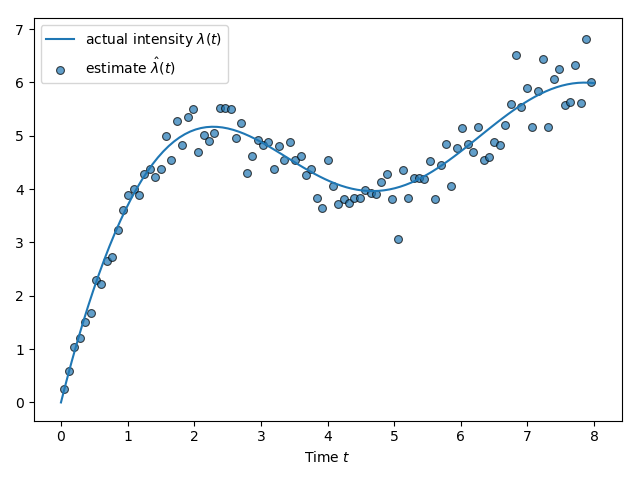

# Python package



High level API for `pointprocesses` as a Python library.

This is a work in progress, much of the core library's functionality hasn't been ported yet and panics are not handled well.

## Installation

This will install the [setuptools-rust](https://github.com/PyO3/setuptools-rust) package to use the convenient PyO3 bindings inside setuptools, if you don't already have it.

```bash
python setup.py install
```

Check it works by importing it inside a Python terminal, outside of this directory, else Python will import the local `pointprocesses` module which isn't loaded with the library.

```python
import numpy as np
import pointprocesses as pp
```

There are working examples in the `pylib/examples/` directory.
